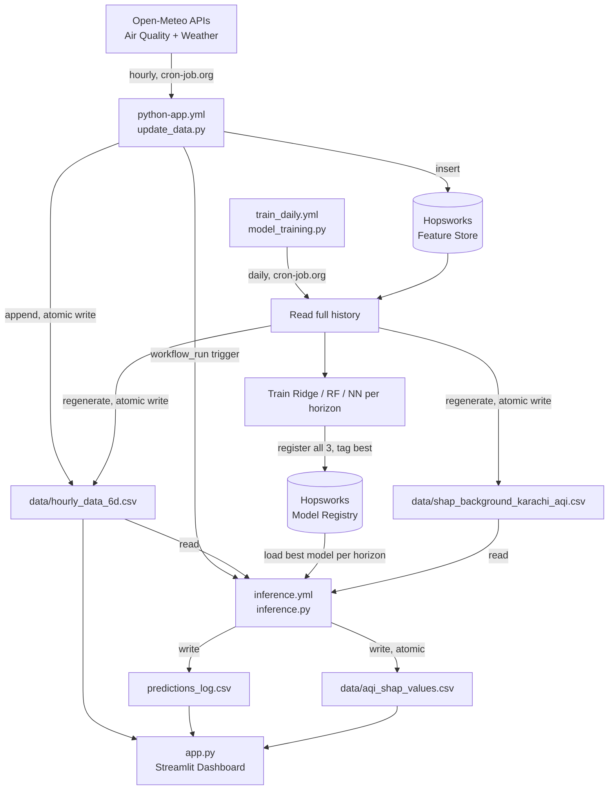

# 🌫️ Karachi AQI Prediction & Forecasting

An end-to-end machine learning system for **Air Quality Index (AQI) prediction and forecasting in Karachi, Pakistan**.

The project combines historical air-quality and weather data, feature engineering, machine learning models, explainable AI, and automated hourly/daily pipelines to power an interactive AQI forecasting dashboard.

---

## 🌐 Live Demo

🚀 **[Launch the AQI Prediction Dashboard](https://aqi-prediction-thllfdfr9tjdsjv9ogjzve.streamlit.app/)**

Explore live AQI readings, multi-horizon forecasts, historical trends, and SHAP-based prediction drivers for Karachi.

---

## 📌 Overview

Air pollution is a major environmental concern in densely populated cities such as Karachi. This project predicts future AQI levels using historical air-quality measurements and meteorological conditions.

The system is built as a scheduled ML pipeline:

**Hourly Ingestion → Hourly Inference → Daily Retraining → Explainability → Dashboard**

GitHub Actions runs the pipeline stages, triggered by an external scheduler. To keep the hourly pipeline fast and reliable, the hot path (ingestion, inference, and the dashboard) reads and writes small CSV snapshots committed to the repo rather than calling the feature store on every run — Hopsworks is used for durable storage of raw data and for the model registry, not for latency-sensitive reads.

---

## ✨ Features

* 📊 Hourly air-quality and weather data ingestion (Open-Meteo)
* 🧠 Three candidate models trained daily per forecast horizon — Ridge Regression, Random Forest, and a Neural Network — with the best-performing one selected automatically (**model selection, not an ensemble**)
* 🔮 Multi-horizon forecasts: 24h, 48h, and 72h ahead
* 🔍 SHAP-based explainability for the latest prediction, per horizon
* 📈 Interactive Streamlit dashboard with live AQI, pollutant breakdown, weather conditions, and forecast trend charts
* 🗄️ Hopsworks Feature Store for raw data persistence and Model Registry for trained models
* ⚙️ Automated hourly ingestion, chained inference, and daily retraining via GitHub Actions
* 📝 Rolling prediction log with backfilled actuals for tracking forecast accuracy over time
* 🔁 Retry logic with exponential backoff for external API and Hopsworks calls
* 🧵 Concurrency-safe writes: atomic file writes (write-to-temp + rename) and Git concurrency groups prevent corrupted or conflicting CSV commits across overlapping workflow runs

---

## 🏗️ System Architecture



*Hopsworks is only touched during ingestion inserts, daily training reads, and model registry lookups — never on the hourly inference or dashboard read path.*

---

## 📂 Project Structure

```text
AQI-prediction/
│
├── .github/
│   └── workflows/
│       ├── python-app.yml      # hourly ingestion (update_data.py)
│       ├── inference.yml       # triggered via workflow_run after python-app.yml
│       └── train_daily.yml     # daily retraining (model_training.py)
│
├── data/
│   ├── hourly_data_6d.csv               # rolling ~6-day window, hot-path read/write
│   ├── shap_background_karachi_aqi.csv  # daily-refreshed SHAP reference sample
│   └── aqi_shap_values.csv              # SHAP values for the latest inference run only
│
├── Notebook/
│   ├── AQI_EDA_and_model_training.ipynb # EDA, preprocessing, and model prototyping
│   └── AQI_data_till_2026-08-22 21_00_00.csv
│
├── scripts/
│   ├── feature_engineering.py       # shared feature logic (training + inference)
│   ├── historical_data_script.py    # one-time historical backfill (not scheduled)
│   ├── update_data.py               # hourly ingestion job
│   ├── model_training.py            # daily training + registration job
│   ├── inference.py                 # hourly prediction + SHAP job
│   ├── requirements_update_data.txt
│   └── requirements_inference.txt
│
├── app.py                         # Streamlit dashboard
├── predictions_log.csv            # append-only prediction history, actuals backfilled hourly
├── requirements.txt
└── README.md
```

---

## 🧩 Main Components

### `app.py`
The Streamlit dashboard. Reads `predictions_log.csv`, `data/aqi_shap_values.csv`, and `data/hourly_data_6d.csv` directly — no live Hopsworks connection is needed to render the dashboard, which keeps it fast and decoupled from feature-store availability.

### `scripts/update_data.py` (`python-app.yml`)
Runs hourly, triggered by an external scheduler (cron-job.org). Fetches the latest AQI + weather reading from Open-Meteo, inserts it into the Hopsworks `karachi_aqi` feature group (with retry/backoff), and atomically appends the new row to `data/hourly_data_6d.csv` for fast downstream reads.

### `scripts/inference.py` (`inference.yml`)
Triggered via GitHub Actions' `workflow_run`, immediately after `python-app.yml` completes — so inference always runs on freshly updated data, never on a stale or overlapping read. Reads the cached 6-day CSV, builds the current feature row, retrieves the best-scoring model per horizon from the Model Registry, predicts, computes SHAP values against the daily background sample, and logs both the prediction and its explanation.

### `scripts/model_training.py` (`train_daily.yml`)
Runs daily, triggered externally (cron-job.org). Pulls the full history from Hopsworks, engineers features, retrains Ridge, Random Forest, and Neural Network models per forecast horizon, registers all three in the Hopsworks Model Registry (tagging the best one), and refreshes the two CSV snapshots (`hourly_data_6d.csv` and the SHAP background sample) used by the hourly hot path.

### `scripts/historical_data_script.py`
A one-time script used to backfill historical air-quality and weather data before the hourly pipeline began running. Not part of the scheduled workflow.

### `scripts/feature_engineering.py`
Shared feature computation used by both training and inference, so the two can never silently diverge in how a feature is defined.

### `Notebook/AQI_EDA_and_model_training.ipynb`
Exploratory notebook used for initial EDA, preprocessing decisions, and model training/evaluation experiments ahead of building the production scripts. Not part of the automated pipeline.

---

## 🤖 Modeling Approach

For each forecast horizon (24h / 48h / 72h), three candidate models are trained daily:

* **Ridge Regression** — regularized linear baseline
* **Random Forest** — tree-based ensemble, handles nonlinearity without scaling
* **Neural Network** — small feed-forward MLP (Keras/TensorFlow)

Each day, the candidate with the lowest test-set MAE **for that horizon** is selected and used for that day's hourly inference — this is **model selection**, not an ensemble; only one model's output is served per horizon, not a blended combination of all three.

---

## 🔍 Explainable AI with SHAP

SHAP (SHapley Additive exPlanations) values are computed for every hourly prediction, showing which features pushed that specific forecast up or down relative to a seasonally-representative background sample (refreshed daily to cover different times of day and seasons). Only the most recent run's SHAP values are kept — the dashboard shows *why this hour's forecast looks the way it does*, not a historical/aggregate view of feature importance.

---

## 🗄️ Why CSV Caching Instead of Direct Hopsworks Reads

Hopsworks' serverless feature store proved unreliable for an hourly-cadence pipeline: single reads/writes ranged from a few seconds to over fifteen minutes, and reads occasionally failed outright with feature-store errors. That variance made it unsuitable for anything on the critical path of an hourly job.

The fix was to scope Hopsworks down to two roles only:

1. **Feature Store** — durable, versioned storage of raw hourly readings (`karachi_aqi` feature group), used as the source of truth once a day during retraining.
2. **Model Registry** — stores and versions the trained Ridge/RF/NN models per horizon.

Every latency-sensitive read — hourly inference, the SHAP background sample, and the dashboard — goes through small CSV files committed to the repo instead, refreshed by the daily training run and appended to hourly by the ingestion job. This removed Hopsworks from the hourly hot path entirely, cutting daily Hopsworks round-trips from roughly 24 down to 1–2.

```text
HOPSWORKS_API_KEY=your_api_key
```

Never commit your actual API key — use a `.env` file locally or your platform's secrets manager in CI/deployment.

---

## ⚙️ Automated Pipeline

```text
External Scheduler (cron-job.org, hourly) ──► python-app.yml (update_data.py)
                                                     │
                                        workflow_run trigger
                                                     ▼
                                            inference.yml (inference.py)

External Scheduler (cron-job.org, daily) ──► train_daily.yml (model_training.py)
```

GitHub Actions' own `schedule:` trigger was dropped in favor of an external cron service after observing it fire inconsistently — sometimes hours late or with multi-hour gaps instead of on the hour. `python-app.yml` and `train_daily.yml` are instead triggered by HTTP calls from cron-job.org, giving much more reliable hourly/daily timing; `inference.yml` still uses GitHub's native `workflow_run` trigger, since it only needs to fire immediately after `python-app.yml` finishes, not on an independent schedule.

All workflows share a Git concurrency group on the CSV files they touch, and use a commit → pull --rebase → push sequence (favoring the locally-generated file on conflict) to avoid corrupting the repo when hourly and daily runs land close together. All CSV writes use an atomic write-to-temp-then-rename pattern so a reader never sees a half-written file.

---

## 🚀 Installation

```bash
git clone https://github.com/SyedAnasAzim/AQI-prediction.git
cd AQI-prediction
python -m venv venv
source venv/bin/activate   # venv\Scripts\activate on Windows
pip install -r requirements.txt
```

## ▶️ Run the Dashboard

```bash
streamlit run app.py
```

## 🔐 Environment Variables

```env
HOPSWORKS_API_KEY=your_api_key
```

Do not commit `.env` files or API keys.

---

## 🛠️ Technologies Used

| Technology       | Purpose                              |
| ---------------- | ------------------------------------- |
| Python           | Core programming language             |
| Pandas / NumPy   | Data processing                       |
| Scikit-learn     | Ridge Regression, Random Forest       |
| TensorFlow/Keras | Neural Network model                  |
| SHAP             | Model explainability                  |
| Streamlit        | Web dashboard                         |
| Plotly           | Interactive visualization             |
| Hopsworks        | Feature Store & Model Registry        |
| GitHub Actions   | Workflow automation & CI              |
| cron-job.org     | Reliable external scheduling          |

---

## 📚 Project Goals

1. Build a reliable, low-latency AQI forecasting pipeline for Karachi.
2. Combine air-quality and meteorological signals across multiple forecast horizons.
3. Make forecasts interpretable via per-prediction SHAP explanations.
4. Automate ingestion, retraining, and inference with minimal manual intervention.
5. Design the pipeline to degrade gracefully around a slow/unreliable external feature store.

---

## ⚠️ Known Limitations

* No automated tests currently cover feature engineering, the atomic-write helpers, or the SHAP pipeline — correctness has been validated by manual pipeline runs, not CI-enforced tests.
* No input validation on incoming API data (e.g. malformed or out-of-range sensor readings pass through to training/inference unchecked).
* Daily "best model" selection is based on that day's own test split, which can make model choice noisy day-to-day rather than reflecting a stable, held-out evaluation.
* No monitoring/alerting if a scheduled workflow silently fails — the dashboard would show stale data with no explicit warning.
* Shared CSV files committed to Git act as a lightweight datastore; this avoids extra infrastructure but is a deliberate trade-off, not a general-purpose pattern (a proper database would remove the git-conflict handling this project needs).

---

## 🔮 Future Improvements

* Add unit tests for feature engineering and data-validation guards on ingested readings
* Add confidence intervals around forecasts
* Track model performance over time (rolling MAE/RMSE) rather than only the latest run
* Add alerting for pipeline failures or stale data
* Extend forecasting to additional cities

---

## ⚠️ Disclaimer

This project is intended for **educational, research, and demonstration purposes**. AQI predictions are model estimates and should not be treated as official environmental or medical guidance.

---

## 👨‍💻 Author

**Syed Anas Azim**
Computer & Information Systems Engineering Student
GitHub: [@SyedAnasAzim](https://github.com/SyedAnasAzim)

---

## 📄 License

This project does not currently specify a license. If you intend to allow others to freely use, modify, and distribute it, consider adding an open-source license (e.g. MIT).
